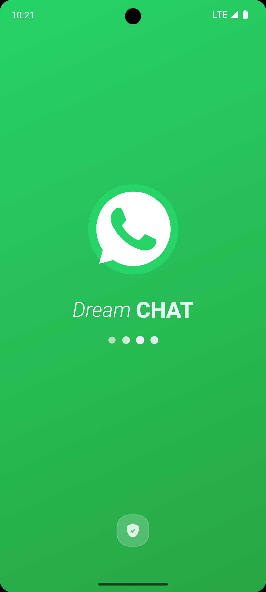
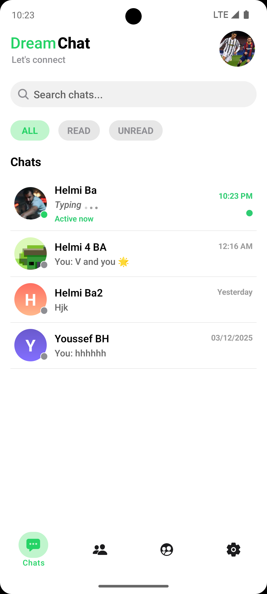
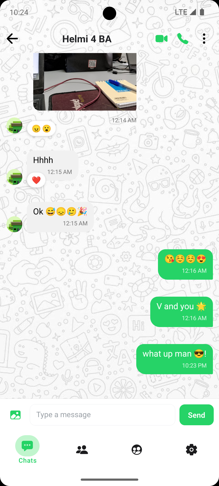
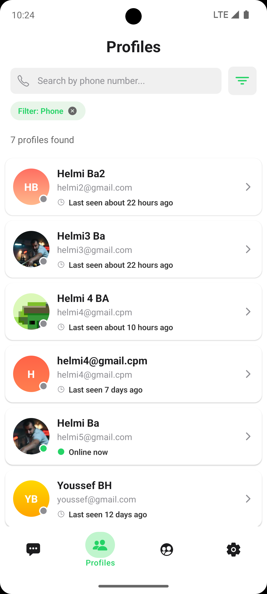
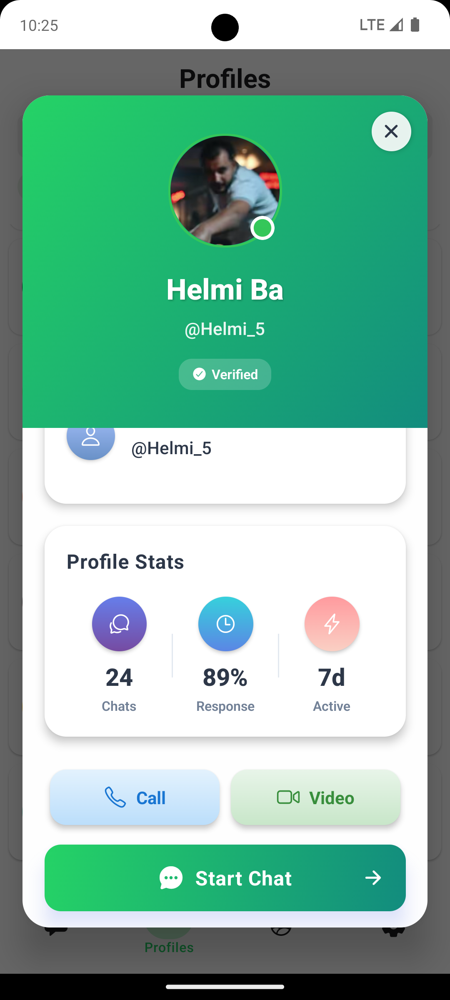
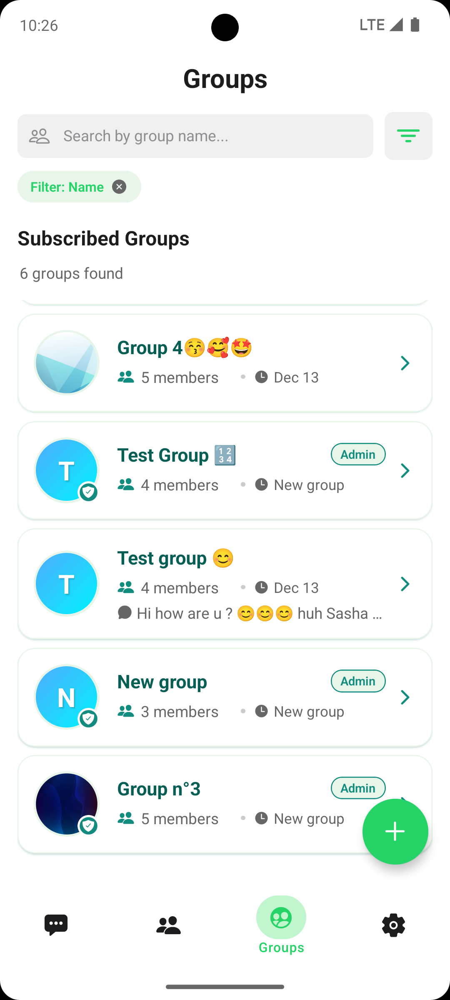
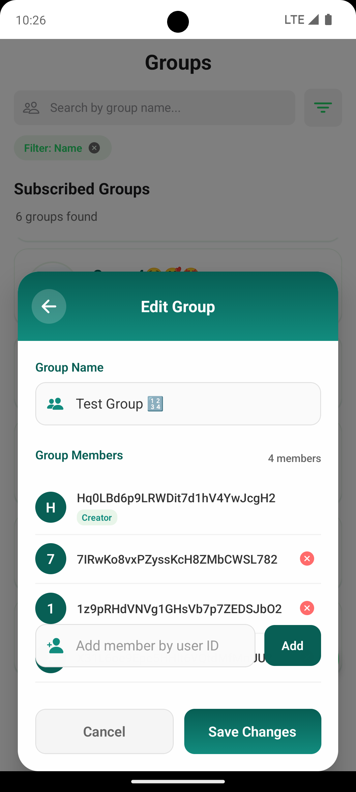
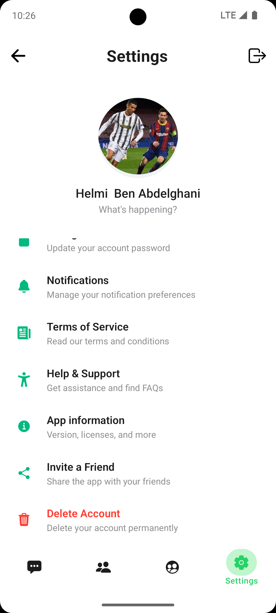
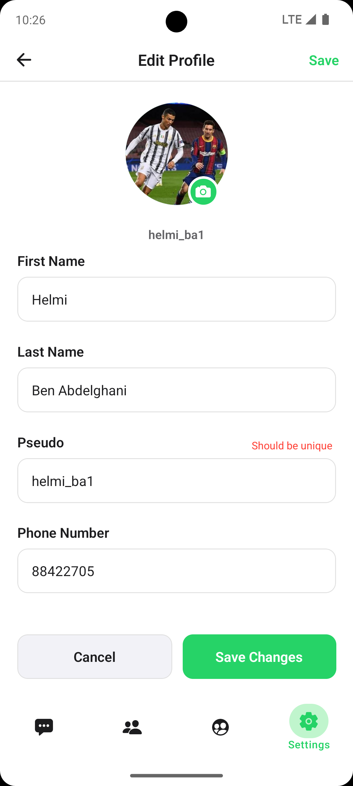
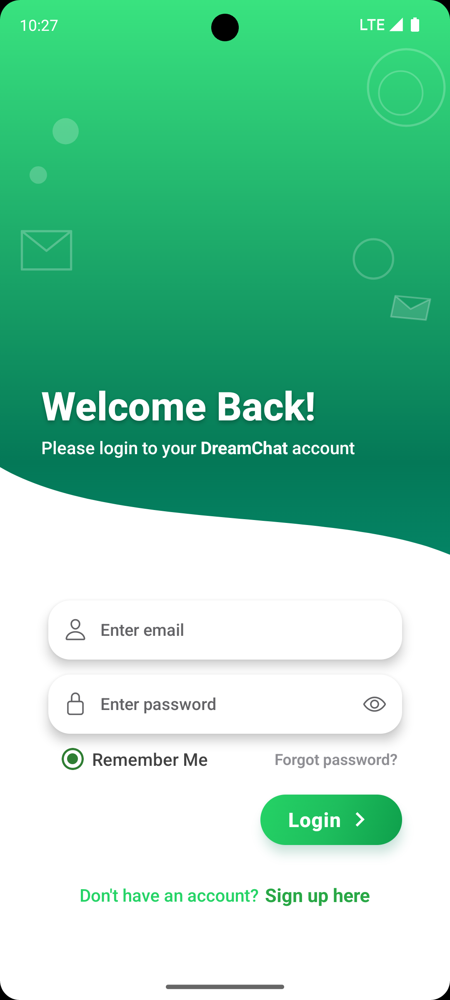

# 🎉 DreamChat — Modern Expo Chat App

   

DreamChat is an Expo + TypeScript mobile chat client with real-time messaging, group invites, reactions (emoji), typing indicators, read receipts, and media sharing. The app uses Firebase Authentication and Firebase Realtime Database for identity, presence, and message delivery, and Supabase Storage (buckets) to host user media (images, audio, video).

<p align="center">
  
</p>

Features
- Realtime 1:1 chats and group chats
- Group creation and real-time invitations
- Direct messages, message reactions, typing indicators, and read receipts
- Upload and share media (images/audio/video) stored in Supabase
- Firebase Authentication (Email, Google, Phone as configured)
- Profiles, edit profile images and chat backgrounds
- Theme support and basic settings

Tech stack
- Expo managed workflow (React Native)
- TypeScript
- Firebase Auth + Firebase Realtime Database (for realtime sync & presence)
- Supabase Storage for media
- React Navigation, Context API and a small services layer (src/services)

Firebase (Auth + Realtime DB)
- Firebase Auth manages sign-in flow (email/social/phone depending on your Firebase console setup).
- Realtime Database is used for:
  - Presence (online/offline)
  - Typing indicators
  - Message delivery with low latency
- Example Realtime DB structure:
```
/users/{userId}            // profile info
/chats/{chatId}            // participants[], lastMessage, updatedAt
/chats/{chatId}/messages/{messageId}  // senderId, text, mediaUrl, createdAt, reactions
/groups/{groupId}          // name, members[], pendingInvites[], metadata
```
- Typical listeners: on('child_added') for new messages, on('value') for small data (presence).

Supabase Storage (media)
- Create a Supabase project and a storage bucket (recommended `chat-media`).
- Public bucket example:
  `https://<project>.supabase.co/storage/v1/object/public/<bucket>/<path-to-file.jpg>`
- Private bucket: use signed URLs for access (recommended in production).
- Upload flow: client uploads media via `src/services/supabaseImageService.ts`, receives URL, attach to message object in Realtime DB.

Gallery:
<table>
  <tr>
    <td align="center">Loading / Splash<br/></td>
    <td align="center">Sign In<br/></td>
    <td align="center">Home / Chats<br/></td>
    <td align="center">Chat View<br/></td>
  </tr>
  <tr>
    <td align="center">Groups / Create Group<br/></td>
    <td align="center">Start Chat / New Chat<br/></td>
    <td align="center">Message Reactions / Media<br/></td>
    <td align="center">Edit Profile<br/></td>
  </tr>
  <tr>
    <td align="center">Alt Chat<br/></td>
    <td align="center">Settings<br/></td>
    <td></td>
    <td></td>
  </tr>
</table>

---

Quick start (development)
Prereqs:
- Node.js (>= 18)
- npm or yarn
- Expo CLI (optional): `npm install -g expo-cli`

Clone & run:
```powershell
git clone https://github.com/Helmi555/DreamChat.git
cd "DreamChat"
npm install
npx expo start
```
Open the Expo DevTools and run on a simulator or device.

Environment variables / config
- Add keys to `src/configs/firebase.js` and `src/configs/supabase.js` or use a `.env` approach and import them.
Required keys:
- FIREBASE_API_KEY
- FIREBASE_AUTH_DOMAIN
- FIREBASE_PROJECT_ID
- FIREBASE_STORAGE_BUCKET
- FIREBASE_MESSAGING_SENDER_ID
- FIREBASE_APP_ID
- SUPABASE_URL
- SUPABASE_ANON_KEY

Key files & structure (important)
- App.tsx — Expo entry
- src/context/UserContext.tsx — auth & session helpers
- src/services/messageService.ts — message send/listen flow
- src/services/groupsService.ts — groups & invites
- src/services/supabaseImageService.ts — upload + signed URL helpers
- src/configs/firebase.js — Firebase config
- src/configs/supabase.js — Supabase config
- src/screens — UI screens
- assets/screenshots — screenshots used in README and docs

Messaging & media flow (summary)
- Sign in via Firebase Auth.
- App initializes realtime listeners for chats and groups.
- Sending a message with media:
  1. Upload to Supabase bucket.
  2. Store returned URL in message object in Realtime Database.
  3. Notify participants via realtime listeners.
- Reactions are small maps on message objects (e.g., { "❤️": ["uid1","uid2"] }).

Security short notes
- Do not commit service-role keys to the client.
- Use private Supabase buckets + signed URLs for production media.
- Limit large data within Realtime DB items to reduce network payload and costs.

Contributing
- Fork → Branch → PR.
- Add or update screenshots when UI changes.
- Consider adding `.env.example`, linting, and CI checks in future PRs.

License & contact
- Add a LICENSE file to the repo root (MIT recommended).
- Maintainer: Helmi555 — https://github.com/Helmi555/DreamChat